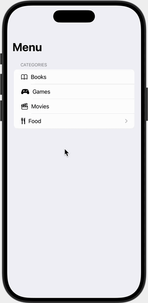

# Homework 8 - iOS SwiftUI Navigation App

## Demo Video


[View demo video](media/demo.mov)

## Project Overview
This SwiftUI iOS application demonstrates navigation between views and loading data from JSON files. The app features a main menu with categories and detailed food item views.

## Modifications Made
- Added navigation functionality to display food categories and items
- Integrated JSON data loading for menu content
- Created detailed item views with full information display
- Added custom styling with rounded images and shadows
- Implemented selectable list items with navigation

## Features
- **Main Menu**: Categories including Cars, Home, Fitness, and Food
- **Food Navigation**: Tap "Food" to see categories (Breakfast, Mains, Dessert, Drinks)
- **Item Details**: Tap any food item to view full details including:
  - Large image display
  - Price information
  - Dietary restrictions
  - Full description
  - Photo credits
- **JSON Integration**: All food data loaded from `menu.json` file

## Technical Implementation
- **SwiftUI** for UI development
- **JSON Decoding** using custom Bundle extension
- **NavigationView** and **NavigationLink** for screen transitions
- **Identifiable Protocol** for list item management
- **Custom Views** for reusable components

## Project Structure
```
Homework8/
├── ContentView.swift # Main menu view
├── Menu.swift # Data models (MenuSection, MenuItem)
├── Helper.swift # JSON decoding extension
├── menu.json # Food menu data
├── Assets.xcassets/ # Image assets
└── README.md # This file
```

## Requirements Fulfilled
- ✅ Uses list and navigation functionality
- ✅ Loads data from JSON file (`menu.json`)
- ✅ Implements Identifiable protocol for data models
- ✅ Includes at least 3 meaningful items in each category
- ✅ Proper documentation in header comments
- ✅ Custom modification (detailed food item views)

## How to Run
1. Open `Homework8.xcodeproj` in Xcode
2. Build and run the project (Cmd + R)
3. Navigate through the app:
   - Tap "Food" from main menu
   - Select any food category
   - Tap any food item to see details

## Assignment Details
- **Course**: CIS137
- **Assignment**: #8
- **Student**: David Deng
- **Date**: October 7, 2025
- **Objective**: Create an app that uses a list of items and navigation functionality
